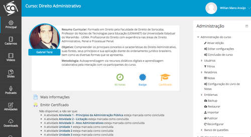

About this theme
================

Modify this theme
-----------------
Feel free to modify and share this theme.

Moodle versions
---------------
This theme works on Moodle 3 and newer. I've not tested this theme in another versions yet.

Supported browsers
------------------
IE9+
Recent versions of all modern browsers

Less CSS
--------
Less CSS is a Object Oriented way of writing CSS code. All Less CSS files
for this theme are stored in the /less folder. A developer can use recess
to generate the CSS files in the /style folder.

Authors
==================

Awesome Copyright and license
---------------------------------------
Author: Willian Mano
URL: http://willianmano.net
